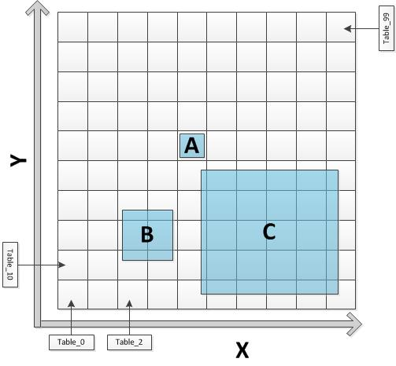

Introduction
------------

TAO Science Modules (specifically the light-cone and SED modules) expect a specific database format. TAO is required to deal with datasets with different data formats, different field names, and different data representation mechanism.

The main functionality of the data import module, which is a part of TAO admin tools, is to perform the necessary data pre-processing required to convert these datasets to the format expected from TAO science modules. 

The data import module is written in python to make it easier to understand and modify by inexperienced developers/astronomer. Since the data importing process for big datasets (e.g. Bolshoi) can take days, the code has been modified to support using MPI and direct binary data copy using psycopg2 to speed this up to less than a day. 

Input Data Format
------------------ 

The data importing process expect its input data in a single HDF5 File according to the format described in the following figure. 

.. figure:: ../_static/importingprocess_hdf5.jpg
   :alt: HDF5 Format

If such data format is not available, the developer is required to write a data conversion code to produce the described HDF5 data before using the data importing code. The array snapshot_displs are not mandatory and can safely be ignored. Other components are mandatory. These components are:

* Cosmology group : these values present the cosmological constants used to produce the data and is provided to the science modules as a metadata. 

    * hubble: the hubble constant value used ( single value)
    * omega_l: the omega_l constant value used (single value)
    * omega_m: the omega_m contact value used (single value) 

* galaxies: is a compound data array with each column present a field and each row present a single data record. It is an n *x* m matrix where n is the number of records and m is the number of fields. Different fields can have different data types. The importing code handle that and convert them to a suitable database datatype. 
* snapshot_displs : It groups the data records (in galaxies) by their snapshot index. This is ignored by the data importing code.
* snapshot_redshift: an array present the mapping between the snapshot index used and their redshift value.
* tree_count: The data are grouped by their treeid in galaxies. The tree_count 1D array present for each tree the number of galaxies in that tree.
* tree_displs: For each tree this 1D array contain the start index in the galaxies dataset for each tree. Both tree_count and tree_displs must be consistence.       

Data Import Process
-------------------

The following figure presents a cross-functional flowchart for the different tasks of the data importing process and how these tasks are distributed over different MPI processes. 

.. figure:: ../_static/importingprocess_CrossFunctional.jpg
   :alt: Importing Process - Cross Functional Diagram 

The details of the HDF file reading and data copying to database are presented in the following figure.

.. figure:: ../_static/importingprocess_ProcessTree.jpg
   :alt: Importing Process - Process Tree 

**The data importing process assume the following**:

* The code assume that the data will be imported to more than one server. The mapping between table IDs and the server ID happens implicitly in a round-robin fashion.
* The code assumes that the Number of MPI processes used >= Number of Database Servers +1 
* Galaxies are grouped by tree id
* Galaxies are assumed to be sorted by their local galaxies ID inside each tree (if no local galaxy id is provided)
* The code assumes that Both tree_count and tree_displs are consistence.

The import code as shown in the cross functional diagram figure use barriers to synchronize between different processes. different sequential tasks are performed. These tasks are mainly performed by process (0) such as creating new database or adding indices to database tables.  The actual data importing process happen in the **import tree** task, which is described in more details in the second flowchart. The code support *resume* if the there was a failure in the previous importing trial. if the user select the *resume* flag to be active the code will not re-create any of the data importing helper tables or the database. It will go directly to the data importing process and continue to handle un-processed trees. Each tree is imported in a single database transaction. 

To speed-up the importing process, specially for very large trees, the code doesn't use *insert statements* to put the data from HDF5 to the database. The code utilize an important feature in postgresql and  psycopg2  which support direct copy of a binary stream of data into postgresql. In order to speed that more, the tables are generated with no index of primary keys. These indices are added later after all trees are processed. 

The process of preparing the data for such data copy process are not very easy. Postgresql expect that each record will be available in the following format:

num_fields | Field1_length | Field1  | Field2_length | Field2 ........... Fieldn_length | Fieldn| 

The importing code prepare this format in a numpy array for all the fields in the HDF5 file and the computed fields. The code automatically handle the datatype mapping for different datatypes. 

See `COPY <http://www.postgresql.org/docs/9.2/static/sql-copy.html>`_ (Binary Format Section) For further details.

Settings for the data importing module
--------------------------------------

The following two figures show a sample setting file content for the import process. The import process can run through interactive session via command line or as a job using qsub. All the messages and progress reports are written into log files in the "/log" directory. Each MPI process write its own log file. So there will be N log files (where N is the number of MPI processes).

.. figure:: ../_static/import_setting1.jpg
   :alt: import setting(a)

.. figure:: ../_static/import_setting2.jpg
   :alt: import setting(b)

The setting file contains three main sections: 

* **sageinput**: Contain the mapping between the HDF5 fields and the database fields
* **PGDB**: contain the postgresql servers connection information.
* **RunningSettings**: contains the path of the HDF5 input file and the metadata required for the importing process.

The field names in the input HDF5 file are completly ignored by the importing code. The importing code will do a direct mapping, based on the field index, between the fields specified in the sageinput section of the setting file and the fields in the HDF5 file. The importing code expect an exact match between the fields specified in the XML and their data types and the fields in the HDF5 file and their data type.

The following fields are mandatory. The importing code will abort with exception if they are not in the list of fields: 

* posx, posy, and posz
* velx, vely, and velz
* snapnum
* treeindex
* coldgas
* metalscoldgas
* sfr
* sfrbulge
* descendant
* stellarmass
* globalgalaxyid

The code will not validate the field mapping for these fields (i.e. no checking is made to validate that *coldgas* is within the reasonable limit). However, the code validates *posx, posy, and posz* against the specified simulation box size.   

Mapping Trees to Tables
-----------------------

The process of mapping trees to tables is vital to determine how the data is distributed over different tables and servers. The simulation box is projected into a two dimensional rectangle which is then partitioned into a structured grid as shown in the figure. The number of cells in this structured grid is determined by *BSPCellSize* value in the setting file. So, the number of cells in the X direction is equal to *SimulationBoxX/BSPCellSize* and the number of cells in the Y Direction is equal to *SimulationBoxY/BSPCellSize*    Each call of this grid is mapped to a single database table. For each tree, the importing code determine its bounding rectangle after projecting all of its galaxies into a two dimensional domain. The intersection between this bounding rectangle and the structured grid cells determine where this tree will be stored based on the following rules:

* If the tree is contained by a single cell  (**Case A**) , the table associated to this cell will be used .
* If the tree bounding table intersects with more than one cell but less than 10 tables (**Case B**), a random table will be selected from the intersection list and the tree will be assigned to it. 
* If the tree bounding box is huge and intersect with more than 10 cells (**Case C**), the tree will be associated with a special table (with index outside the cells indices).

System Tables
--------------

The current tables are automatically generated by the importing code and contain additional metadata and information that helps the science modules. Querying these tables are not enabled by the TAP module.

* **galaxymapping**: mapping between galaxyID and their tables. This table used for debugging purposed only this the moment. 
* **metadata**: key-value mapping metadata about the dataset
* **snap_redshift**: mapping between snapshot index and the associated redshift.
* **summary**: for each table it contain the bounding box details (minx,miny,minz,maxx,maxy,maxz), the minmimum and maximum snapshot nnumber, and the records count.
* **table_db_mapping**: look-up for mapping table name to the database server where it is stored. 
* **treelocationscount**: for each tree how many grid cells intersect with its bounding rectangle. This table is currently used for debugging purposes only. 
* **treemapping**: this table contain multiple entry per tree each show intersection between its bounding rectangle and a cell in the structured grid.
* **treeprocessingsummary**: used during the import process to support resume. It contain information about the treeid, the galaxies count per tree and if it has been processed or not.
* **treesummary**: for each tree in the dataset it contain its bounding box, galaxies count, and where it is stored (table name). 

 

