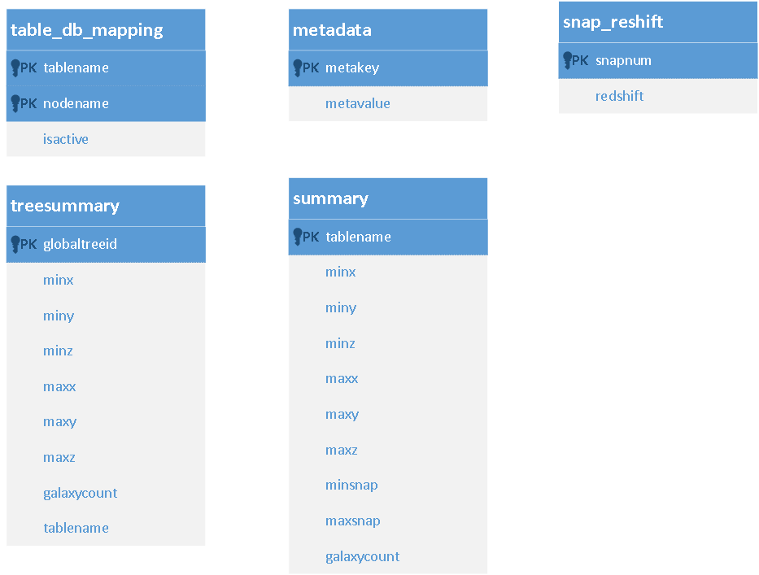

====================================================
TAO: DISTRIBUTING A DATASET OVER MULTIPLE DB SERVER
====================================================

A single DB server is not enough to handle the planned datasets and the volume of queries generated from distributed Lightcone/SED jobs. 
The current system distributes each dataset (down to a specific volume) over multiple (physical) database servers. 

This documentation follows the following conventions in its naming:

- **Dataset**: Is a complete simulation with all its associated data (e.g. Millennium_Full)
- **Database**: an entity which contain at least one table of data. A dataset can be split into one or more database. The default assumption (unless otherwise specified) is that these databases will be physically distributed over multiple database servers.
- **Database server**: a hardware unit which host one or more database and is identified using its node name. These hardware units must be connected directly to gStar and SwinStar Nodes via infiniband.

The distribution architecture adopts the following design assumptions:

- Cross database queries are not allowed. This means that each database will be a standalone entity with no relation with other databases. 
This rule is enforced by the lack of cross database queries in postgresql. dbLink Module presents a work around to make this possible if necessary (with a big performance penalty). 
So, it will be left as a backup option but it is highly encouraged not to be used.
- Data tables are distributed between different databases in a round-robin fashion. 
The aim is to minimize the load over different servers and allow faster data extraction by enabling N*M queries to run at the same time (given that we have N servers and each one them can afford M connections simultaneously).
- A Table-to-database mapping (Table_DB_Mapping) should be replicated over all the databases. So, a connection to any of these databases is enough to know where different tables are stored.
- The security credentials (user name, password, and associated rules) to connect to all different database servers are the same. The database name will be the same between different database servers. So, the only different between different dataset’s databases will be the server IP (node name).
- At a single moment, there might be more than an active (check the active flag) copy of a table. So, the relation between tables and databases is a one-to-many relation. These copies can be activated/deactivated, but in any moment, there must be at least a single active copy of each data table. This feature will be left for a future support of data replication and rollover support (If enough storage is provided). For the first implementation, the developer can choose to use any of the active table locations. Later, the selection should be controlled by the replication and the load balancing rules.
- All tools updating the backend databases need to ensure that the tables with replication are consistent by sending the same SQL update/insert/delete commands to all the databases.
- A tool for re-copy replicated tables from the master DB should be provided to override the existing copies. This should be used periodically to overcome any data inconsistency. 
- As soon as the data importing process finishes, the databases is a read-only data source (no record editing or adding is allowed from the science modules).

The following figure shows all system (non-data) tables in our main database template.

   
QUERYING DATA TABLES - IMPLEMENTATION DETAILS
---------------------------------------------

- Single interface is used to access all the databases. This module is the data layer between different system components and the database. This module encapsulates the database distribution part and hides its burden from other system modules. So, other system components act as if it is dealing with a single databases system. This module is named (for this report usage) DDatabaseInterface. 
- On the other hand, The DDatabaseInterface does NOT perform any query parsing. The query functions and their output are compatible with SOCI library. 
All the DDatabaseInterface functions except the initialization functions take table name as a parameter.
- The DDatabaseInterface loads during its initialization the following:

	* *Connection strings* to different database servers.
	* Open connection to each of these databases and keep them in a dictionary (indexed using their server IP or node name).
	* Load the *DB mapping* information into an in-memory data structure.

- For each query the DDatabaseInterface class maps the table name to the correct DB connection and return the correct SOCI object. This is done with an operator overloading of the indexing operator (“[]”), where the indexing parameter is the table name to be queried. The return is the correct SOCI object.
- Connection restarting and other connection related functionality (e.g.: open and close) are encapsulated within the DDatabaseInterface class.
 