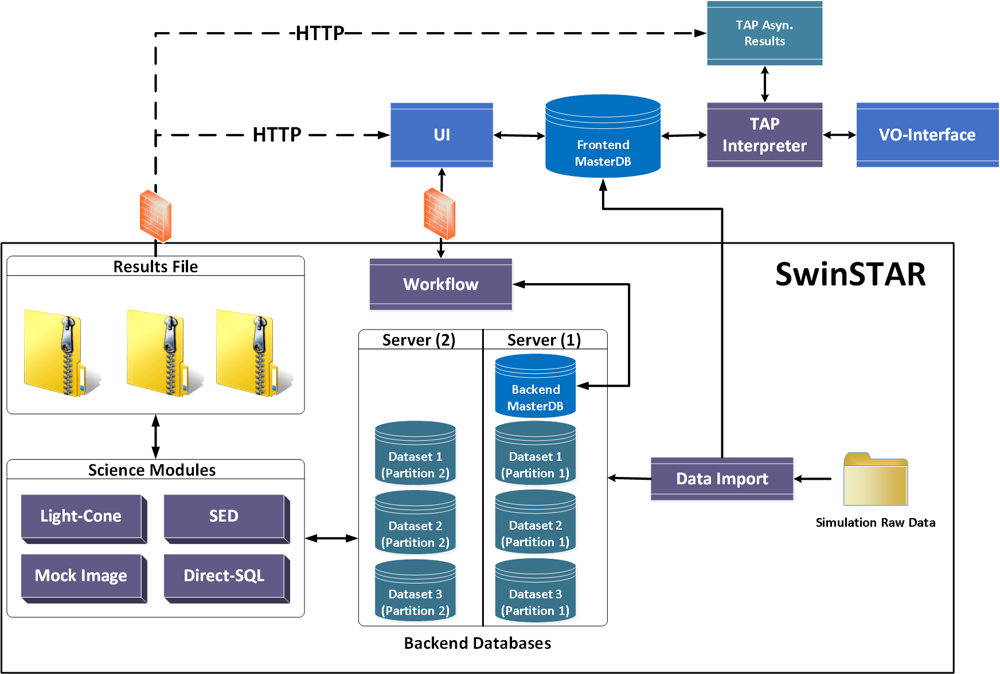

TAO Hardware and Database Architecture
======================================
.. figure:: ../_static/mainsystem.png
   :alt: Main system hardware design

Design Assumptions
------------------

- In order to support `VO Table Access Protocol (TAP) <http://www.ivoa.net/documents/TAP/>`_, the ability to support executing direct SQL query to the database (the simulation data) is a mandatory requirment. This limit the ability to use No-SQL Databases and HADOOP-like processing architecture.
- Efficient handling of large datasets is the main challenge for the TAO project. In this context, the ability to query and access the underlying datasets is the system’s main performance bottleneck.
- Using a commercial version of a distributed Relational Database Management System (RDBMS) will limit further adoptability of the system in an open source enviroment and add a significant burden on the system main budget.

Design Decisions
----------------

- Using a distributed (cluster) database solution is preferred over the single node DBMS. Using cluster DBMS will speed-up different data access processes, and support better system scalability to more and bigger datasets.
- The current hardware architecture is partitioned into three main servers and the `SwinSTAR Supercomputer <http://astronomy.swin.edu.au/supercomputing/green2/>`_ with the following specifications:
  
  * One low-end Web-Server (Node A in figure 1)
  * Two identical medium class application/database-servers (Node B and C in figure 1)
  
    The functionality and details of these nodes will be discussed in details in the next section.
- The main system storage will be an integrated part of the gStar lustre file system with at least Node B and C connected to it via an infiniband connection. The usage of the lustre file system speeds-up the data access and query processes.

Hardware Components 
-------------------

**Web-Server Node (NODE A)**

- Hosts the main system interface and web-services. This separates the interface rendering and interaction from the main system processing, which means that the UI interfactions will not be affected (in terms of response time and stability) with the systems Back-End processing load.
- Hosts *TAOMaster* database (MySQL Community Server). The *TAOMaster* database stores the following information:

  * The users’ information including different login details and quota mapping.
  * Information about different processing requests and their status.
  * Meta-data about different dataset available in the systems and different science module.
  * Information about different intermediate or final data products and its physical location.
- Handle different data downloading/uploading via HTTP.
- Invoke and provide monitoring facilities for science module jobs 

**Application/Database-servers (Node B and C)**

- Host multiple instances of PostgreSQL Database ( an instance per server  - currently 2 servers)
- Host the *Workflow Scheduler* application, which handles different data processing tasks' invocation and monitoring.
- Perform main database operations including indexing, partitioning, query, insert, update.
- Acts as a secured bredge between the UI components and the science modules running on SwinSTAR.

TAO Software Architecture
=========================

