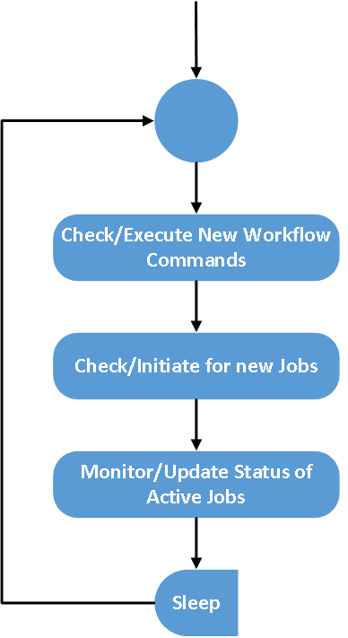
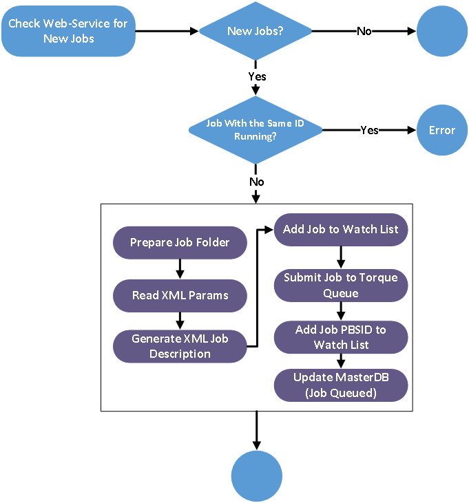

===============
Workflow Module
===============

Workflow Job
------------

The expression "Workflow Job" is used to refer to a sequence of a single data processing request prepared through the system's UI components and described via XML document. Within the TAO context data processing request is a an ordered execution sequence of science modules with one or more output file. In most of the cases the first element of this execution sequence include extracting information from one of the back-end database (*simulation dataset* in *RDMS*).
   
The execution of a single data processing job (Workflow job) is expected to take a considerable computational resources (i.e. memory, processing time, and I/O overhead). Its execution time varies from seconds to days based on the job complexity. So, these jobs are initiated and monitored by the workflow module in Asynchronous manner (i.e. The UI component should not expect an immediate or near-immediate reply from the back-end modules). The monitoring of such jobs is performed using a call-back web-services.  

Workflow Command
----------------

In addition to the list of submitted jobs, the UI will provide a second list (as a web-service JSON response) to facilitate executing immediate commands. These commands should not be related to jobs lower than the “submitted” state.  Also, the UI will provide a web-service to update the command status. 

The following categories of commands are supported:

- *Job Control Commands* (stop, stop All). In this case the job status is updated to "Held" state. In order to restart a job the admin should convert it to to “submitted” state.
- *Workflow control commands* (stop, resume). This will hold the workflow from searching for new jobs but will not affect the current running jobs. 
- *Job Output Commands* (delete). This will enable deleting/modifying an existing job output folder.

Workflow Module Main Functionality
----------------------------------

The workflow component works as a background service (Linux Daemon). It acts as an interface between the UI components and the SwinSTAR Torque Queue. 
Workflow Daemon check a secured web-serivce for new Jobs every 30 seconds. To start a new Job, the Workflow Daemon requires the following details:

- *UI Reference ID* for the Job ( to be used for further communication)
- *User Name* for the job owner
- *Database Name* that reflects the dark matter simulation and galaxy model selected.
- *Job Parameters* described in XML format. This includes which Science Modules to be used, the parameters needed for each of these modules, how these Science Modules are connected to produce the expected result(s), and the output format of the expected result(s).   

Job execution status is the main tracking field for jobs. The workflow daemon is responsible for updating the job status for each running jobs as soon as a change is detected. 

Jobs status Change according to the following rules:

It converts the jobs description provided by the UI components (via a JSON web-service) into a Torque Queue job. 

To achieve this, it runs an event-loop with a configurable delay between each run.

The following steps explain the process of handling new Workflow Job:  

- The UI component prepares all the jobs parameters and dataset specification in a XML file and submit it with an identifier for the requested job to the workflow queue on the TAOMaster DB. 
- The workflow module should be working as a consumer for this job queue on the TAO servers (B or C).
- The workflow module should check this queue with a constant time step to update the status of the current tasks and check for new tasks. 
- A job description file is generated by the workflow module from a template. The new task is submitted to the corresponding torque queue (TAO or gSTAR) via qsub.
- The job will be executed when sufficient resources are available. 
- The workflow will keep updating the job status (e.g Pending for resources, and running) until the job is finished. 
- The workflow will notify the UI component to send email when the job is finished. 
- If there is a waiting dependence for the current job the workflow will initiate it with the appropriate parameters.  

   

