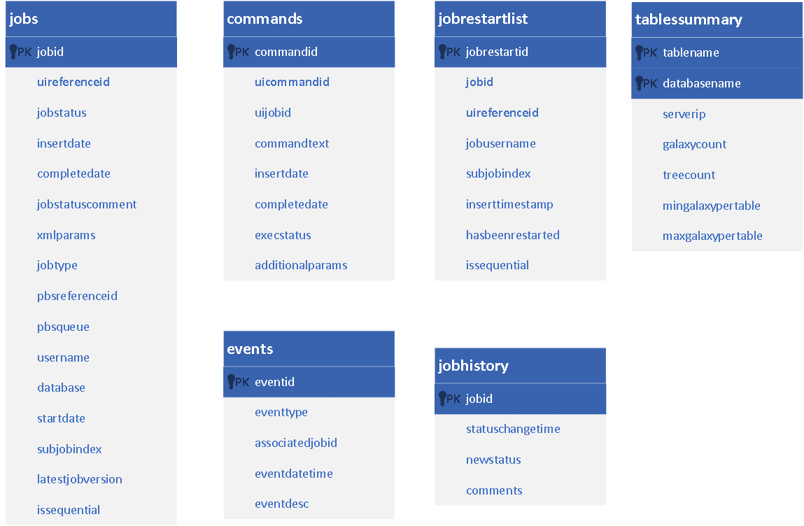
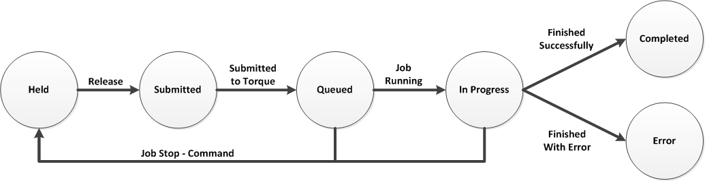

===============
Workflow Module
===============

Workflow Job
------------

The expression "Workflow Job" is used to refer to a sequence of a single data processing request prepared through the system's UI components and described via XML document. Within the TAO context data processing, request is an ordered execution sequence of science modules with one or more output file. In most of the cases the first element of this execution sequence include extracting information from one of the back-end database (*simulation dataset* in *RDMS*).
   
The execution of a single data processing job (Workflow job) is expected to take considerable computational resources (i.e. memory, processing time, and I/O overhead). Its execution time varies from seconds to days based on the job complexity. So, these jobs are initiated and monitored by the workflow module in Asynchronous manner (i.e. The UI component should not expect an immediate or near-immediate reply from the back-end modules). The monitoring of such jobs is performed using a call-back web-services.  

Workflow Command
----------------

In addition to the list of submitted jobs, the UI will provide a second list (as a web-service JSON response) to facilitate executing immediate commands. These commands should not be related to jobs lower than the “submitted” state.  Furthermore, the UI will provide a web-service to update the command status. 

The following categories of commands are supported:

- *Job Control Commands* (stop, stop All). In this case, the job status is updated to "Held" state. In order to restart a job the admin should convert it to  “submitted” state.
- *Workflow control commands* (stop, resume). This will hold the workflow from searching for new jobs but will not affect the current running jobs. 
- *Job Output Commands* (delete). This will enable deleting/modifying an existing job output folder.

Back-End MasterDB
-----------------   

The following figure shows the MasterDB UML diagram. 
    

The database contains six main entities:

- *jobs* table stores the details of each job submitted to the back-end.
- *commands* table stores the details of each command submitted to the back-end.
- *events* table is used as an event-log for the workflow.
- *jobhistory* table is used as a log to store the jobs' history.
- *jobrestartlist* table is used to store the jobs to be automatically restarted by the workflow.
- *tablessummary* table is used to store summarized information about each table in the science databases.

The figure shows the primary key(s) or each table. In general, the following conventions are used:
 
- The workflow stores the reference ID used by the UI module with a prefix "ui"
- The workflow module uses its own local primary keys but keeps a mapping between the local keys and the UI keys to facilitate communication between the two modules.  
- The mapping between the UI keys and the workflow keys for jobs and commands are one-to-many, which means that a single UI job/command can have multiple workflow job/command associated to it. This represents that ability to run a single UI job/command multiple times. While the UI doesn't keep track of these runs, the workflow keeps track of them by associating a new ID for each run-request.

Workflow Module Main Functionality
----------------------------------

The workflow component works as a background service (Linux Daemon). It acts as an interface between the UI components and the SwinSTAR Torque Queue. 
Workflow Daemon checks a secured web-service for new jobs every 30 seconds (Configurable Parameter).

.. figure:: ../_static/workflow.png
   :alt: Workflow Design

To start a new Job, the Workflow Daemon requires the following details:

- *UI Reference ID* for the Job ( to be used for further communication)
- *User Name* for the job owner
- *Database Name* that reflects the dark matter simulation and galaxy model selected.
- *Job Parameters* described in XML format. This includes which Science Modules to be used, the parameters needed for each of these modules, how these Science Modules are connected to produce the expected result(s), and the output format of the expected result(s).   

Job execution status is the main tracking field for jobs. The workflow daemon is responsible for updating the job status for each running job as soon as a change is detected. 

Job's status Change according to the following rules:

The job's parameters provided by the UI acts as the base for the job parameters provided by the workflow module to the science modules to determine their execution sequence and their parameters. So, the workflow reads and modifies the XML parameters to generate a new XML file (or set of XML files) to be used to configure these modules.  

The following steps explain the process of handling new Workflow Job:  

- The UI component prepares all the jobs parameters and dataset specification in an XML file and submits it with an identifier for the requested job to the TAOMaster DB. 
- The workflow module should be working as a consumer for a web-service which queries the database for current jobs ("Submitted" status Only).  
- The workflow prepares a separate folder for each new job.
- The workflow read the *XML params* provided by the UI module and generate *XML Job Description*.
- The workflow then prepares a torque job description file and submits the job to the torque queue to be executed.
- The system utilizes the torque queue as the main resources scheduler in this case. The job should be executed as soon as appropriate resources are available.  
- The workflow will keep updating the job status until the job is finished. 

   
.. figure:: ../_static/workflow_NewJobs.png
   :alt: Workflow - Adding new Job

   