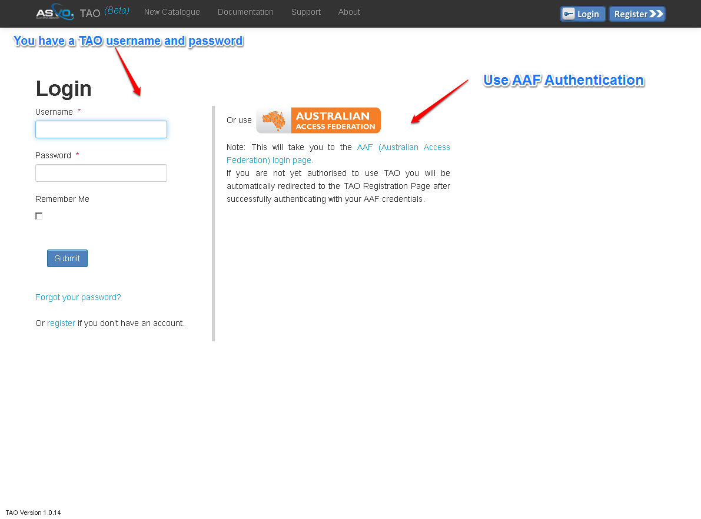

User Registration
=================

**Why registration is required**

Many astronomical datasets are freely available to download from the web in their raw form without the need for an account. 
However, TAO is different in that both datasets of significance and value-adding eResearch tools are being coupled online and made available to the community. 
Such tools require high performance computing to process (such as Swinburne University’s supercomputer, gSTAR), and these resources are expensive to install and maintain. 
Hence, to ensure that they are not wasted or abused, and to help us continually optimise the system, we are requiring all users of TAO to be registered. 
Anyone with a legitimate association with the Astronomy community will be granted an account. The login and registration forms are accessible from the home page as shown in the figure above. 

**TAO supports two methods of authentication:**

Australian Access Federation (AAF)
   AAF authentication allows users from `participating institutions <http://aaf.edu.au/subscribe/subscribers/>`_ to log on using their institutional credentials.  
   To register follow the AAF link in the TAO login page and you will be automatically redirected to the AAF registration page.

Local
	If you cannot or prefer not to use your institutional credentials, you can register for a TAO account using the TAO registeration from. 
	After submitting your registration request, you need to wait for an approval from our admin team.
	

**Change your Password**
	The system will show the current logged-in user in all pages after you logged-in. You can Log-out or change your password using the drop-down menu next to your username.

	 

