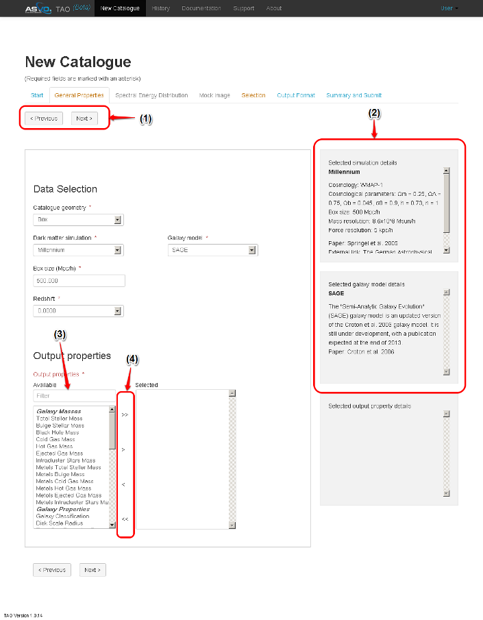
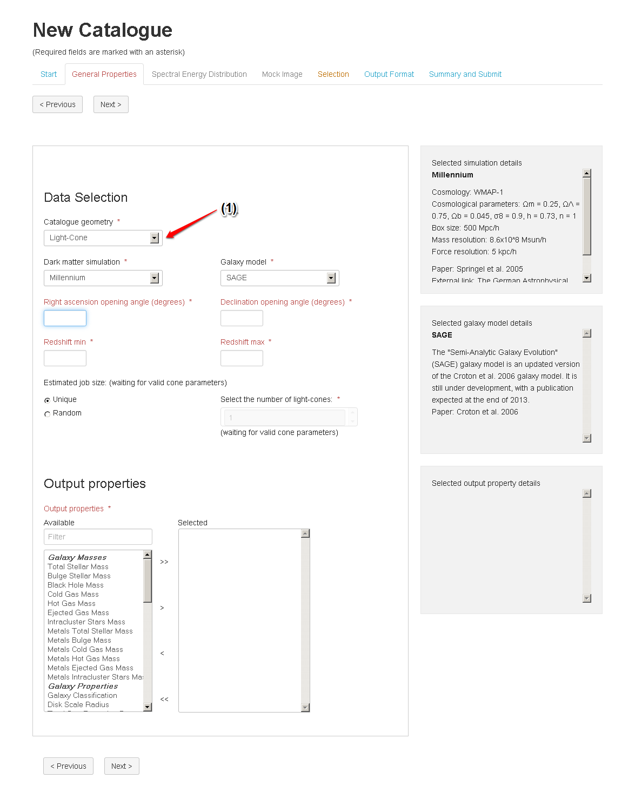
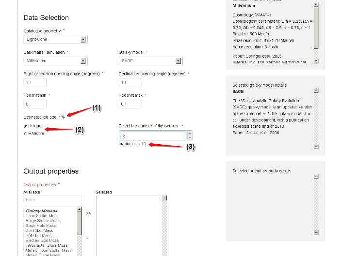
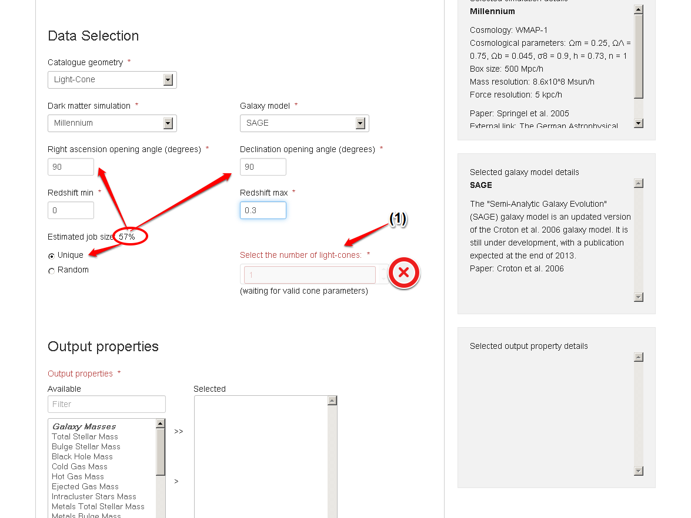
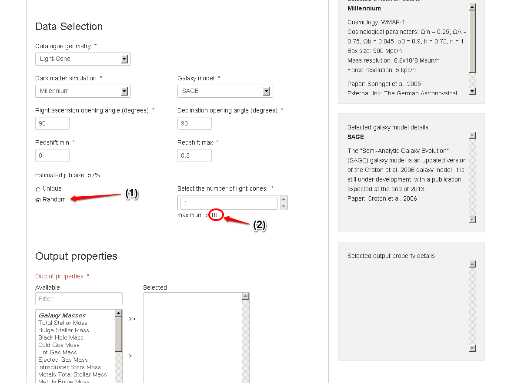
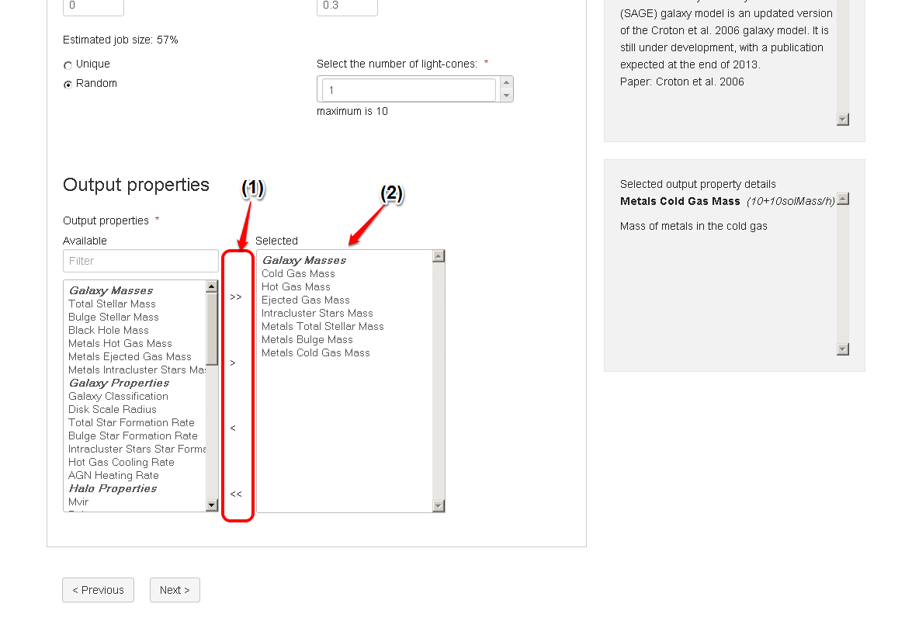

General Properties
===================

The following figures assume that the user has decided to start a new catalogue. Below we show the main components of the General properties form. 
 
1. **Navigation buttons**: This will help the user to navigate forward and backword between different parts of the Mock Galaxy Factory.
2. **Information panels**: Used to provide additional scientific information (or meta-data) about the user’s current selection.
3. **Property list**: Displays all the properties available for a given model/simulation.
4. **Properties selection/removal buttons**: Used to add/remove the properties to be included in your mock catalogue.

In TAO one can select between two different *catalogue Geometries*:

* Box: Returns a single snapshot (redshift) of the simulated universe.
* Light-cone: Maps the geometry of the simulated data cube on to the observer cone. 

The user then decides on the dark matter simulation and galaxy model, both selected from the drop-down boxes.
   

   
Based on the user selection of *Dark Matter simulation*, *Galaxy Model*, and Geometry Size, the system estimates the requested job size (an indication for how big the job is). 
Due to the scheduling and resources availability there might not be a direct mapping between this estimate and the actual job's execution time. It can be used as a rough guide however.
     
   

**Light-Cone Geometry**   

* Right Ascension, Declination and Redshift
	Defines the dimensions of the light-cone.
* Unique / Random
	If the dimensions of the light-cone exceed the dimensions of the simulation, the simulated space is repeated out to the required dimensions.  Selecting between Unique and Random light-cones specifies how the simulated space is expanded. Selecting Unique ensures that no volume from the original simulation space is used multiple times in the resulting light-cone. Selecting Random allows the universe to be expanded indefintely, with the original cube randomly rotated each time it is repeated to minimise any patterns appearing through repetition.
	The UI will compare the volume of the light-cone requested against the simulation volume. 
	If the volume of the light-cone is bigger than the simulation volume and the user selected the unique option, the UI will show an error. In this case the user should revise their selection. 

   

   

   
The user should then select from the available properties in the Output Properties list. The information panel (on the right) shows the details of the currently selected property, including its data unit.
   
   

   
