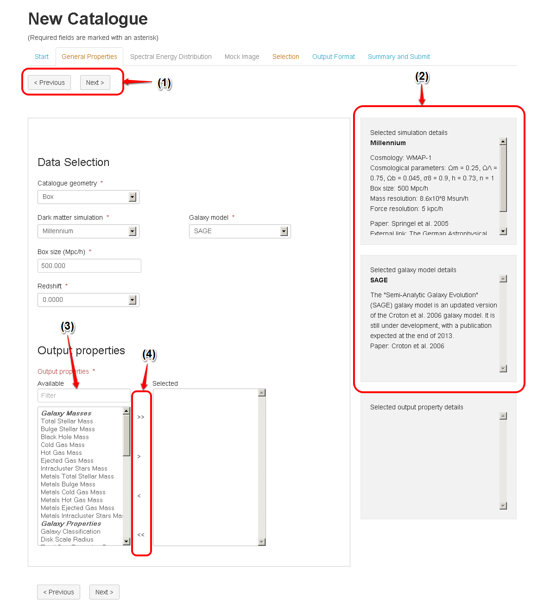

General Properties
===================

The following figures assume that the user selected to start a new catalogue. So, there is no pre-selection of pre-filled values. 
The following are the main parts of the General properties form (as shown in the first figure). 
 
1. **Navigation buttons**: This will help the user to navigate forward and backword between different parts of the Mock Galaxy Factory.
2. **Information panels**: On the right of the form and it is used to provide additional scientific information (or meta-data) about the user's current selection.
3. **Filter field**: it is used to filter the shown properties based on the user entered value
4. **Properties Selection/Removal buttons**: used to include/remove properties to/from the selected properties list.

The use has the option to select between two different *catalogue Geometries*: 

* Box: Returns a single snapshot (redshift) of the simulated universe.
* Light-cone: Maps the geometry of the simulated data cube on to the observer cone. 

Also, The use can choose to select between the following different *Dark Matter Simulation*:

* Mini-Millennium
* Millennium
* Bloshoi  

Additionally, the user has the option to select between the following *Galaxy Models*:

* The "Semi-Analytic Galaxy Evolution" (SAGE) galaxy model (Croton et al. 2006)
* Galacticus (Benson 2010)
   

   
Based on the user selection of *Dark Matter simulation*, *Galaxy Model*, and Geometry Size, The system estimates the requested job size (an indication for how big the job is). 
Due to the scheduling and resources availability there might not be a direct mapping between this estimate and the actual job's execution time. Though, it should be used by the user as an estimation for how much resources this job will request from the system.
     
   

**Light-Cone Geometry**   

* Right Ascension, Declination and Redshift
	Defines the dimensions of the light-cone.
* Unique / Random
	If the dimensions of the light-cone exceed the dimensions of the simulation, the simulated space is repeated out to the required dimensions.  Selecting between Unique and Random light-cones specifies how the simulated space is expanded. Selecting Unique ensures that no volume from the original simulation space is used multiple times in the resulting light-cone. Selecting Random allows the universe to be expanded indefintely, with the original cube randomly rotated each time it is repeated to minimise any patterns appearing through repetition.
	The UI will compare the volume of the light-cone requested against the simulation volume. 
	If the volume of the light-cone is bigger than the simulation volume and the user selected the unique option, the UI will show an error. In this case the user should revise his selection. 

   
.. figure:: ../_static/screenshots/TAO-Mock_Galaxy_Factory5.png
   :alt: Mock Galaxy Factory - Unique Light-Cone
   

   
Then, the user should select from the available-properties-list the properties he wants to include in his output file. The information panel (on the right) shows the details of the currently selected property including its data unit.
   
   
.. figure:: ../_static/screenshots/TAO-Mock_Galaxy_Factory7.png
   :alt: Mock Galaxy Factory - General Properties   
   
