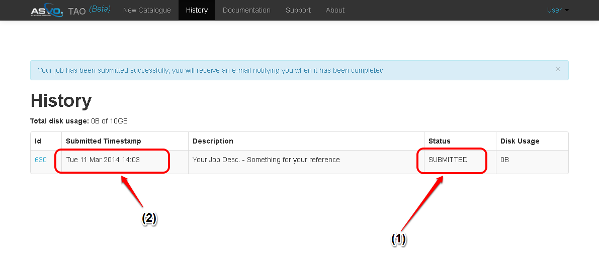
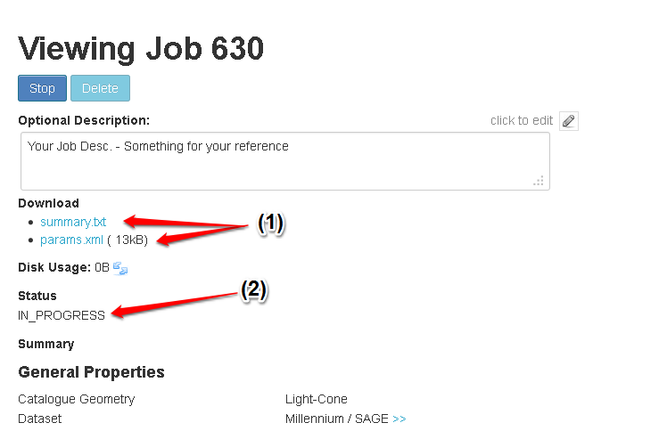

Manage Submitted Jobs (History)
===============================

After submitting a job, the user interface will forward the user to the Job history page. This can also be accessed later using the *history* link in the interface top-bar.

For each job, the history table displays the current job status(1), submission date/time(2), job ID, and user description (if given).

Once a job has been submitted in TAO it will go through a number of states before being ready to download:

=========== ======================================================
State
=========== ======================================================
HELD        The job is held in the TAO queue and will not be executed until set to submitted by an administrator.
SUBMITTED   The job has been submitted in the web UI and awaiting processing by the workflow.
QUEUED      The job has been submitted for processing on the HPC.
IN PROGRESS The job is currently being executed by the HPC.
COMPLETED   The job has completed and is ready for download.
ERROR       The job terminated abnormally.
=========== ======================================================

 

The user can follow the job ID link to view more details about the job and to Stop/Delete the job. The Job summary (in text format) can also be downloaded, as can the TAO job description (in XML format). This latter file (params.xml) can be used to re-generate the job.

