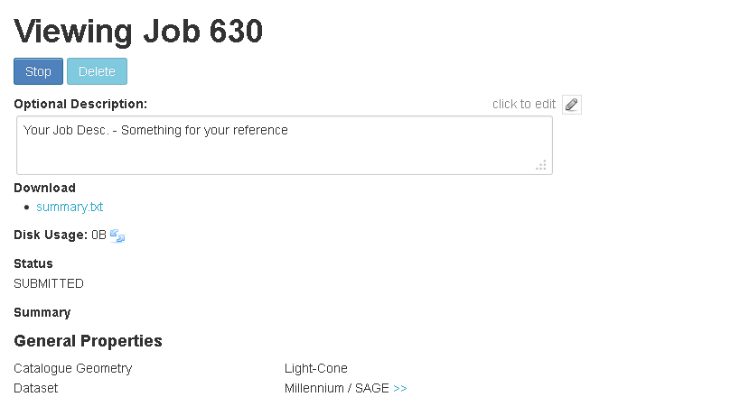

Manage Submitted Jobs (History)
===============================

After submitting the job, the UI will forward the user to the Job history page. It can be accessed later using the *history* link in the interface top-bar.

For each of the jobs, the history table display its submission date/time, its ID, the user description (if exists), and its current status.

Once a job has been submitted in TAO it will go through a number of states before being ready to download:

=========== ======================================================
State
=========== ======================================================
HELD        The job is held in the TAO queue and will not be executed until set to submitted by an administrator.
SUBMITTED   The job has been submitted in the web ui and awaiting processing by the workflow.
QUEUED      The job has been submitted for processing on the HPC.
IN PROGRESS The job is currently being executed by the HPC.
COMPLETED   The job has completed and is ready for download.
ERROR       The job terminated abnormally.
=========== ======================================================

 

.. figure:: ../_static/screenshots/TAO-Mock_Galaxy_Factory21.png

The user can follow the job ID link to view more details about the job and to Stop/Delete the job. He can also download a Job summary in text format or a TAO job description (in XML format).
The XML (params.xml) can be used later on to re-generate this job. 

.. figure:: ../_static/screenshots/TAO-Mock_Galaxy_Factory23.png
