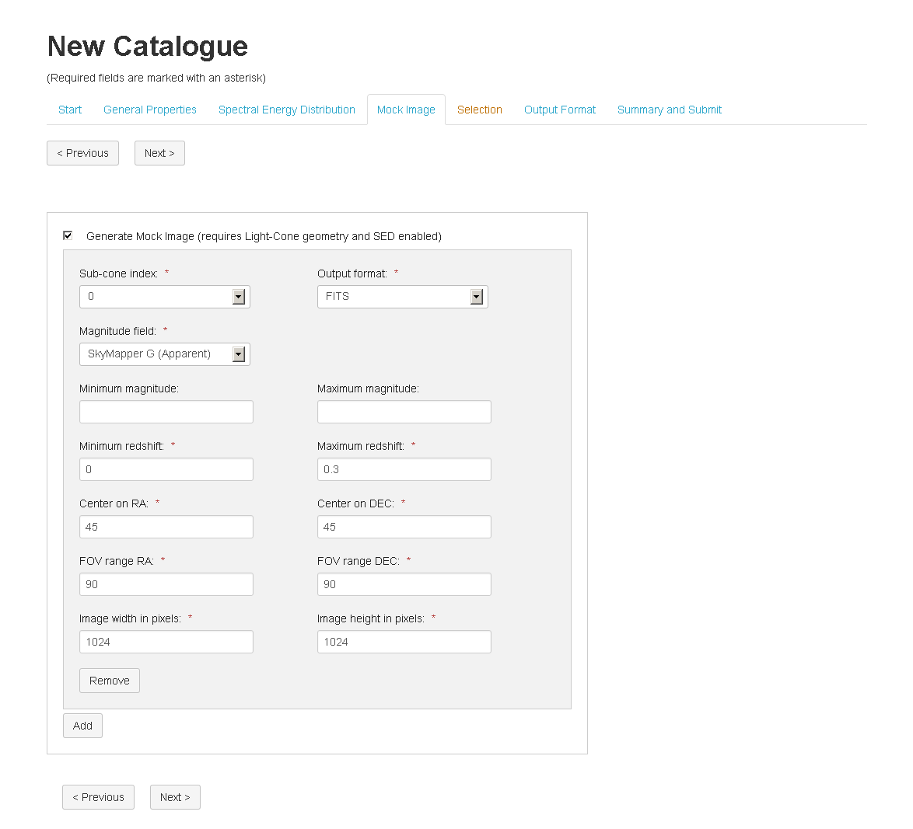

Mock Image
==========

If the user enables the SED module, he can use the output of the SED module to general mock images using `SkyMaker <http://www.astromatic.net/software/skymaker>`_. The image generation module enable the user to use one (or more) cones to generate multiple images.He can also select the Magnitude field to be used to generate this image and the output format.     
In case the user selected to generate more than one light-cone in the first module, he can generate images with different paramters for each of these cones by selecting the *sub-cone index*.

The fields sub-cone index and Magnitude field are automatically populated based on the user selections in the previous modules.

.. figure:: ../_static/screenshots/TAO-Mock_Galaxy_Factory11.png

   
.. figure:: ../_static/screenshots/TAO-Mock_Galaxy_Factory13.png
