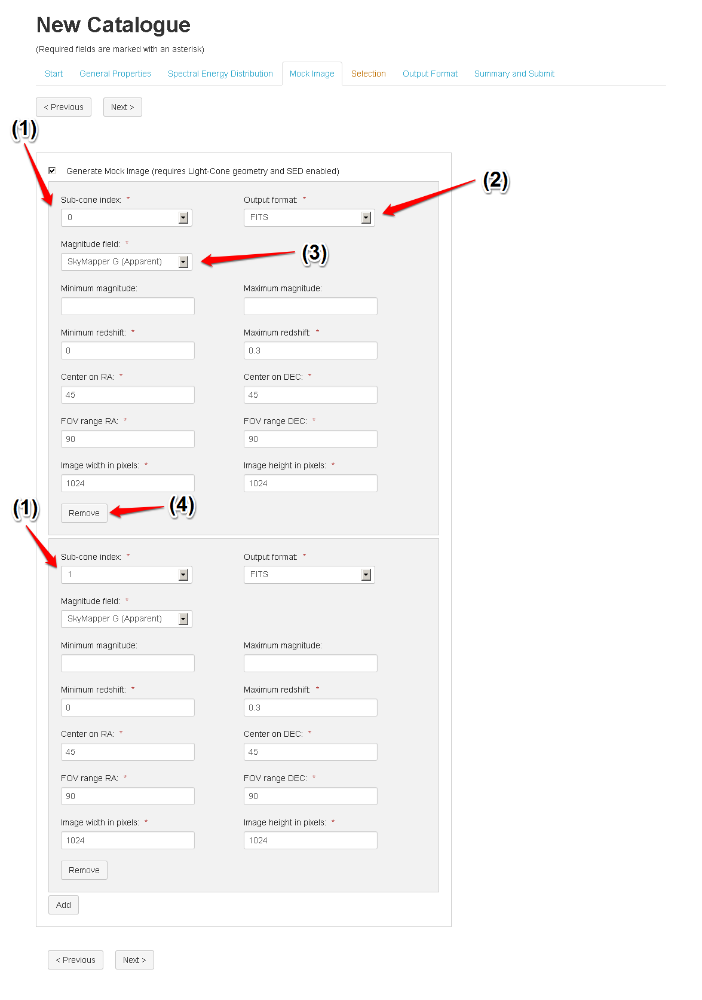

Mock Image
==========

Before the Mock Image module can be selected the user must have chosen a light-cone geometry in the General Properties tab and selected at least one filter in the SED module. The Mock Image module uses the `SkyMaker <http://www.astromatic.net/software/skymaker>`_ image generation package. If the user has selected more than one light-cone then images with different parameters for each selected cone can be made at the same time.

The fields "Sub-cone index" (1) and "Magnitude" (3) are automatically populated based on the user selections in the previous modules, but can be changed with a drop-down menu. The image output format can be specified by (2). To add an image click "Add", to remove one click "Remove" (4).

   

