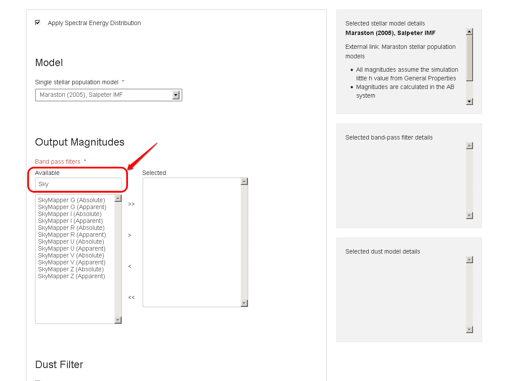

Spectral Energy Distribution
============================

By default, the Spectral Energy Distribution (SED) module is disabled. If you would like apparent or absolute magnitudes, in addition to the output properties chosen in the previous tab, enable it by checking the box.

.. figure:: ../_static/screenshots/TAO-Mock_Galaxy_Factory8.png

In order to apply the SED module, the user needs to select:

* Single stellar population model 
* Output Magnitudes (Band pass filters)
* Dust model (optional)

 
.. figure:: ../_static/screenshots/TAO-Mock_Galaxy_Factory9.png

As before, information about a selection is given in the right panel (1). Filter selections can be made by adding them to your selection list (2). A dust model can be applied from a drop-down list (3).
   

