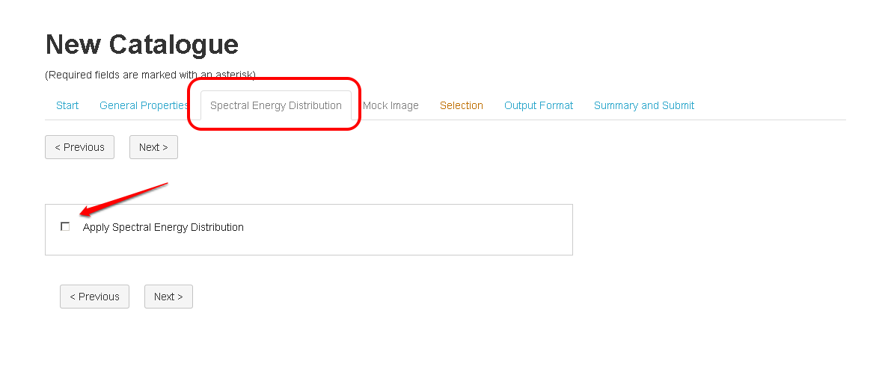
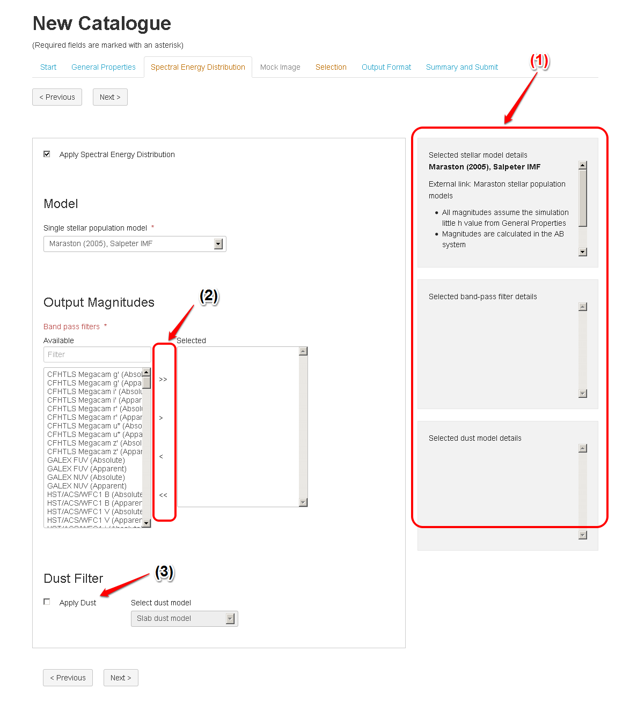

Spectral Energy Distribution
============================

By default, the Spectral Energy Distribution (SED) module is disabled. So, it is an optional post-processing for the light-cone module.

In order to apply the SED module, the user needs to select:

* Single stellar population model 
* Output Magnitudes (Band pass filters)
* Dust model ( optional))

 

The user can use the "Filter field" to narrow down the selection in the Available list. as shown in the following figure.
   
.. figure:: ../_static/screenshots/TAO-Mock_Galaxy_Factory10.png
