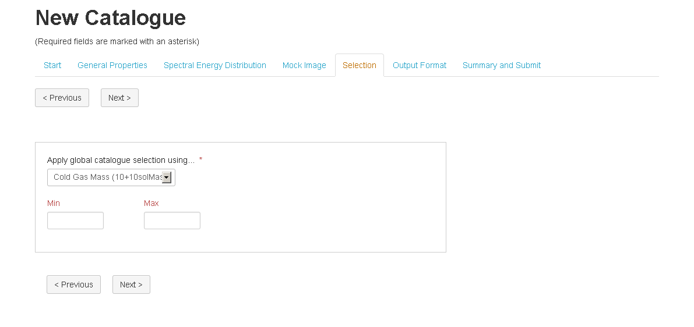
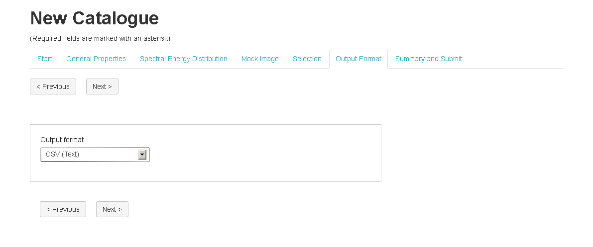

Selection (Data Filter)
=======================

TAO requires the user to apply one filter to their selected data, based on their previously selected properties. This filter is global and will apply to the entire mock catalogue.

Output Format
=============
TAO supports four output formats for the final mock catalogue:

* CSV
* FITS
* HDF5
* VOTable (XML)

Please note that the Mock Image module output format is selected within the Mock Image module form. If you would like to view the data and perform general visualisations the VOTable and FITS format files can be read by `TOPCAT <http://www.star.bris.ac.uk/~mbt/topcat/>`_
If you need to write some code to do more detailed analysis, sample scripts demonstrating how to access the data are avilable in the :ref:`script-lib`.

 

