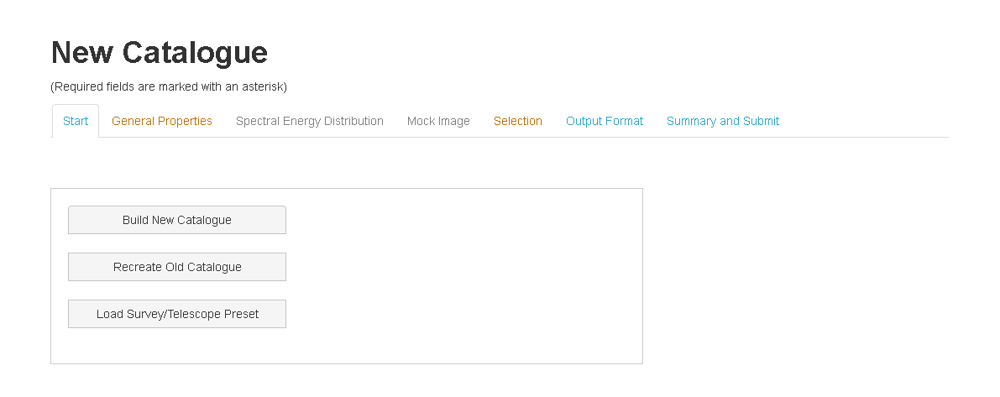
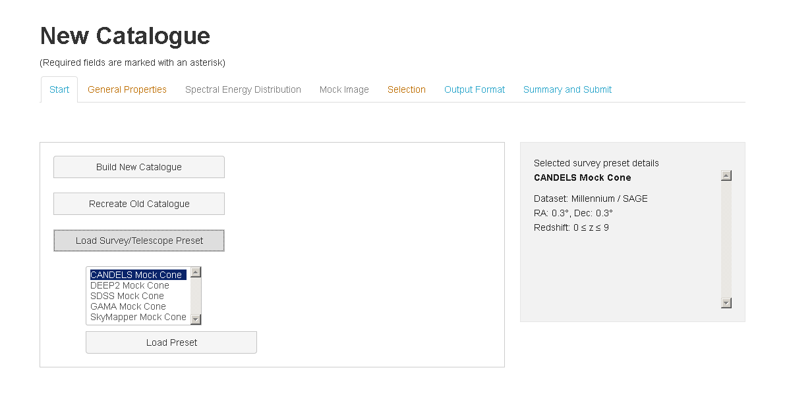

Start
=====

The TAO Mock Galaxy Factory enables you to create a *Mock Catalogue* using one of three options as shown in the following figure:

* Create a new catalogue
* Create a catalouge based on an old TAO catalouge (Re-generate Catalogue)

* Load a pre-defined catalogue preset (See the following figure). The current available presets are:
	
	* CANDELS Mock Cone
	* DEEP2 Mock Cone
	* SDSS Mock Cone
	* GAMA Mock Cone
	* SkyMapper Mock Cone

On the right panel, you can find a summary about each of these presets.

   