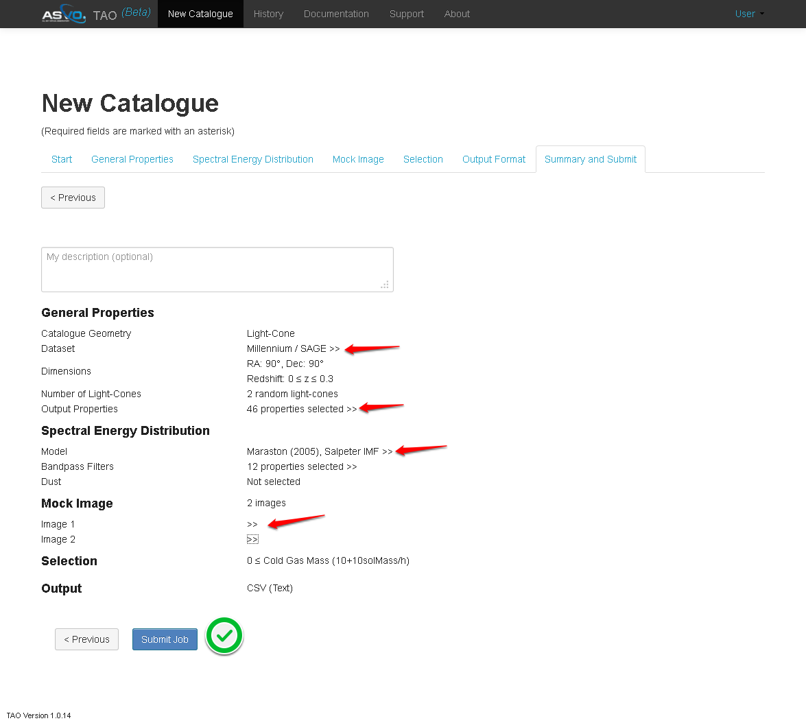
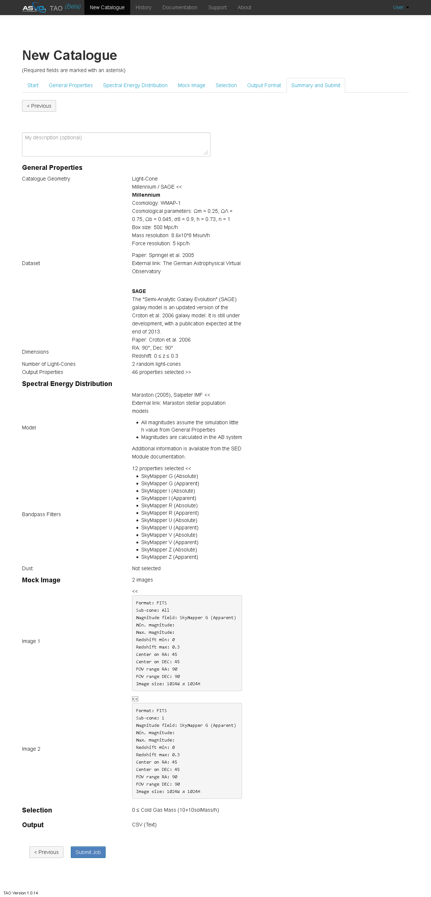
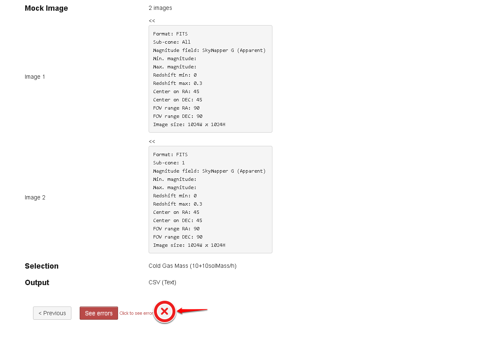

Summary and Submit
===================

The final step shows a summary of the selected catalogue paramters. It also gives the user the chance to add a catalogue description. 

The double arrows (>>) can be used to expand the summary to provide mode detail.
   

   

A job will not submit if there are errors. The user can check any errors by following the "click to see errors" link.

   

