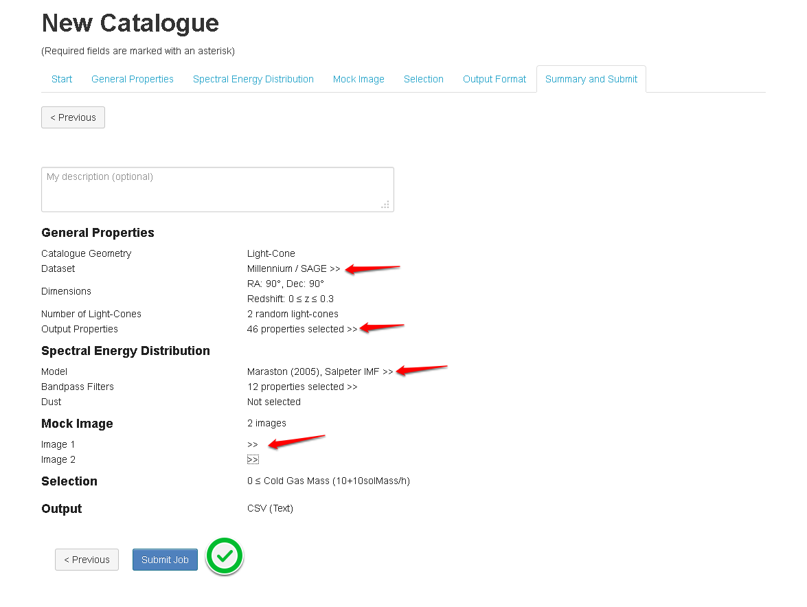
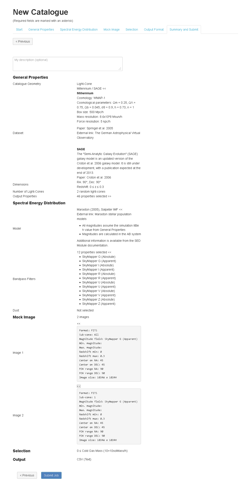

Summary and Submit
===================

The final step shows a summary for the selected job paramters. It also give the user the chance to add a job description. 

   

   

The user will not be able to submit the job if the UI validation fails at any points. He can check the validation error by following the *click to see errors* link.

   

